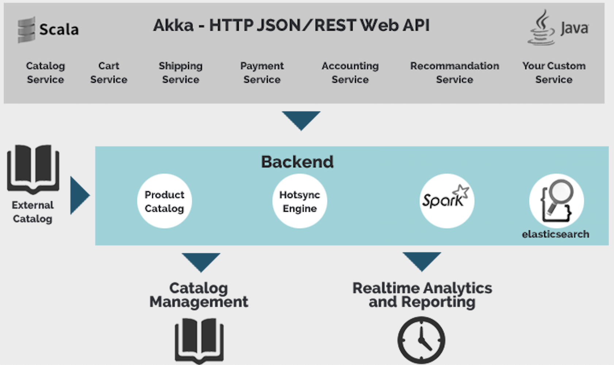

# mogobiz
The MogoBiz ecommerce platform was created with high scalability and top performance in mind. That’s why it was developed with the latest, best of breed technology.

## Multi-Channel & Multi-Device
MogoBiz is designed with fully modular services that can be customized and extended as needed. These services are accessed using the REST / JSON protocol, which lets you develop your frontend in whatever language you prefer, or whatever language needed for the devices and channels your ecommerce site supports. Multi-channel and multi-device capabilities are inherent to the MogoBiz platform.

## Performance & Scalability
Mogobiz is a highly scalable platform based on reactive design patterns. It is built around the CQRS principle for instant rendition of your product database. Akka-HTTP and Elasticsearch are the core building blocks of our product. They maximize the scalability of your site and optimize the use of resources in the cloud.

## Analytics
Based on our in-house expertise and our Search-View-Click-Acquire approach, MogoBiz offers high-end statistics in real-time. Using Big Data technology and Machine Learning techniques, MogoBiz helps you monitor site activity and identify new and high-value customers. Analytics are made available through interactive and customizable dashboards.

## 1-to-1 Customer Relations
MogoBiz uses Apache Spark and Spark Streaming for personalized recommendations, such as:
- Items frequently bought together
- People who viewed/bought this also viewed/bought this
- Recently viewed products
- Recommendation based on customer journey

## DevOps & Agility
MogoBiz is a collection of micro-services that allows for hyper fast start up times – less than a second! – for short development cycles. MogoBiz also provides instant deployment with zero downtime. It natively supports Docker and Ansible.
